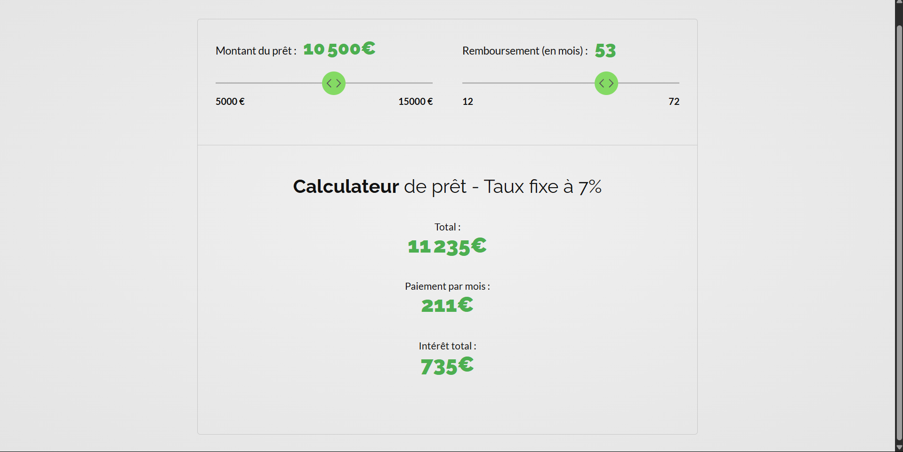

# application de pret bancaire

# Projet de Simulation de Prêt Bancaire

Ce projet est une application web permettant de simuler un prêt bancaire avec des paramètres personnalisés tels que le montant emprunté, la durée, le taux d’intérêt, etc.

## 🔗 Lien de l'application

👉 [Accéder à l'application en ligne](https://pret-bancaire.netlify.app/)

## 🚀 Fonctionnalités

- Simulation de crédit bancaire
- Calcul des mensualités
- Affichage du tableau d'amortissement
- Interface responsive

## 🛠️ Technologies utilisées

- HTML, CSS, JavaScript
- [Tailwind CSS](https://tailwindcss.com/)
- Hébergement via [Netlify](https://www.netlify.com/)

